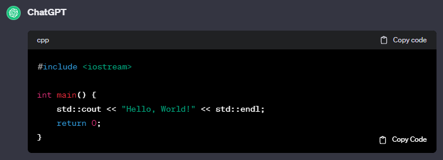
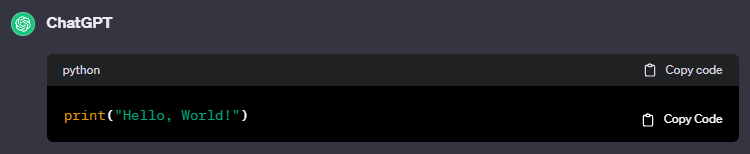

###

# CodeGrab

CodeGrab is a project aimed at improving user convenience on _[ChatGPT](https://chat.openai.com)_ by integrating a 'Copy Code' button into code blocks. This enhancement will streamline the process of copying code snippets.

    
    

## Installation Tutorial

Available in [Edge-AddOn](https://microsoftedge.microsoft.com/addons/detail/codegrab/hdfhhmdlkfihcmlmdnkfamgepiakbglb)

### 1. Download CodeGrab

On The _[GitHub Repository](https://github.com/j-zunino/CodeGrab)_ , click on the "Code" button and select "Download ZIP".

## 2. Extract the files

Once the ZIP file is downloaded, extract the content on your computer.

## 3. Open extension management Page

1. Go to the menu (three dots) in the top right corner.
2. Select "Extensions" > "Manage Extensions."

## 4. Enable developer mode

Enable "Developer mode".

## 5. Load CodeGrab

1. Click the "Load unpacked" button.
2. Select the folder where you extracted the CodeGrab extension files.
3. Click "Select Folder."

## 6. Verify installation

After loading the extension, you should see the CodeGrab icon in your browser's toolbar.

## 7. Test on chat.openai.com

Visit _[ChatGPT](https://chat.openai.com)_ and navigate to a conversation with code blocks. You should now see a 'Copy Code' button within each code block.

If you encounter any issues or have suggestions for improvement, feel free to contribute to the GitHub repository.
